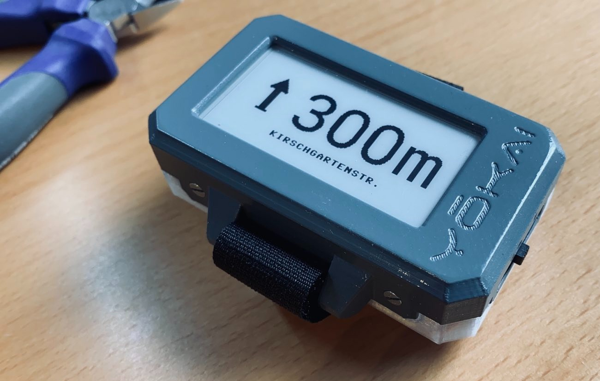
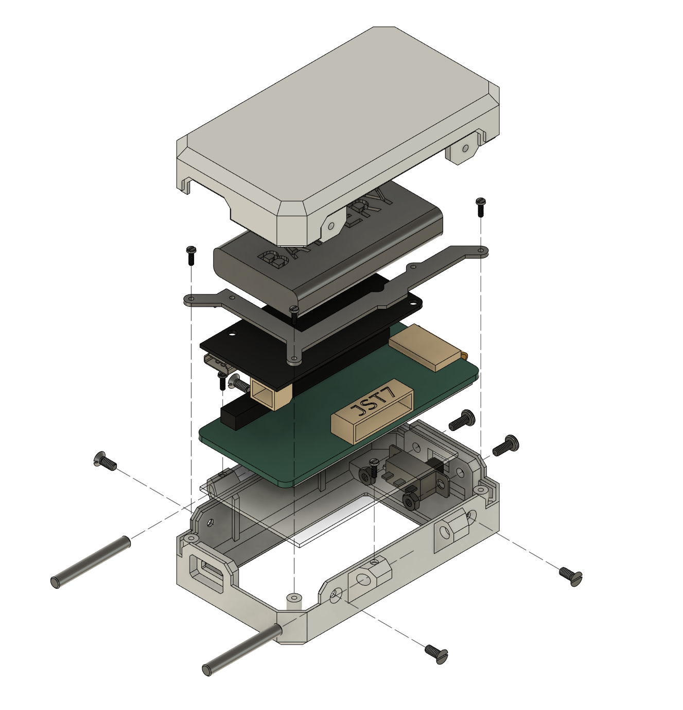

# YŌKAI - An e-Paper navigation display for Komoot

Yokai is an open-source navigation instruction display based on an ESP32 microcontroller that hooks into [Komoot](https://apps.apple.com/app/komoot/id447374873)'s Bluetooth API running on a smartphone (currently only supporting iOS).
While Komoot is responsible for all the GPS and navigation magic, Yokai merely display the navigation instructions while your phone sits snugly in your pocket. Using a velcro strap, you can attach it to a bike handle or wear it on your wrist.
The e-Paper display ensures great visibility outdoors, and together with communication over Bluetooth Low Energy (BLE) the power consumption is minimal: your phone will run out of juice long before Yokai. And compared to your usual cike computer this thing is dirt cheap.

The name "Yōkai" stems from japanese folklore, where it describes supernatural spirits and entities.

## How to build a Yōkai
**Please note:** The current model of Yokai runs on a LOLIN32 Lite connected to a e-Paper HAT originally designed for Raspberry Pis. Getting those two connected involves quite a bit of soldering, even more if you want to monitor battery voltage. However, I have since found out about the [LILYGO T5 v2.3](https://de.aliexpress.com/item/32869729970.html), which combines an ESP32 with the very same e-Paper display on the same PCB! Using this board will make building a Yokai a lot easier, and I am now working on porting Yokai to the T5. But if you feel like tinkering, here's how to build your very own Yokai:

Tools you will need:
- A 3D printer of your choice to print the case
- A soldering iron
- A set of tiny screwdrivers
- Crimping tools (or just some plyers) for JST plugs.
- Some wrenches that can handle the very small nuts used here. I ended up just printing some, check the [3D prints](./assembly/3d_prints/).

The parts required (as well as the 3D print files) can be found in the [BOM](./assembly/bom.md). I printed the case top and the ESP mounting bracket in eSUN PLA+, and the case bottom in translucent PETG for extra style points. Depending on your color choice you might want to fully print the parts in PETG to any dark-colored PLA getting soft when heated up by sunlight.

### Assembly
Not going to provide detailed assembly instructions because I'm now working on the T5 version, but have this exploded view:

Not pictured here: the LOLIN32 is mounted to its bracket using two of the M1.2 screws and nuts, as well as the 3D-printed washers. The polycarbonate screen is simply glued to the case top.

**TODO: add wiring instructions**

### Software setup

1. Install micropython on your LOLIN32: Go to the [micropython documentation](https://docs.micropython.org/en/latest/esp32/tutorial/intro.html#esp32-intro) and follow the instructions. Note that you need micropython >= 1.16.
2. Clone this repo if you haven't yet.
3. Using [ampy](https://github.com/scientifichackers/ampy), [rshell](https://github.com/dhylands/rshell) etc. copy the contents of the `src` directory onto the LOLIN32.

## How to use Yōkai

1. If you are interested in a Yokai, I assume you're already using Komoot. But if for some reason you haven't yet, install [Komoot](https://apps.apple.com/app/komoot/id447374873) from the app store.
2. Open Komoot, go to the profile section and open the settings menu (little cogwheel on the top).
3. Navigate to 'Bluetooth Connect' and connect to a new device. Pick any of the shown bike computers, doesn't really matter which. Make sure Bluetooth is enabled!
4. Turn on your Yokai. After a few seconds it should automatically detect your Phone and connect to it. Komoot will display a checkmark next to the chosen device.
5. Start a trip using Komoot & Yokai! Whenever going on another trip, just start the navigation on your Phone and turn on Yokai right after. Make sure that your phone is unlocked until Yokai has successfully connected, I haven't figured out yet how to deal with iOS's different BLE behaviour when the phone is locked.

## TODOs
- **ADD WIRING INSTRUCTIONS**
- **Switch to LILYGO T5** - This will eliminate almost all the soldering that is currently required!
- Android support - currently only iOS is supported
- Better user interface - better font for street names, cleaner direction arrows
- Make this work on a [Watchy](https://watchy.sqfmi.com/) (assuming I can actually get my hands on one)
- ...